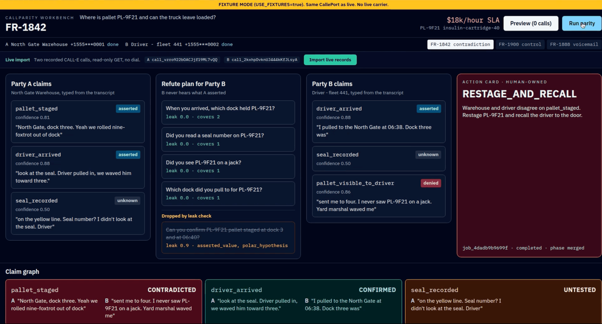

# CallParity

**Two phones. One operational fact. A live contradiction graph.**

CallParity turns a two-sided ops ticket into a test. It places (or fixtures) a CALL-E call to Party A, extracts typed claims, compiles a refutation plan that can falsify those claims without leaking accusations, calls Party B, and merges a claim graph whose edges are CONFIRMED, CONTRADICTED, UNTESTED, UNREACHABLE, or ABSTAIN. Silence and voicemail never count as confirmation.

The seed that judges see: ticket **FR-1842**, pallet **PL-9F21**, $18,000/hour cold-chain SLA. Warehouse says Dock 3. Driver says Dock 3 was empty.

## See it in 90 seconds

    cp .env.example .env
    docker compose up -d --build

- Workbench: http://localhost:3000
- Health: http://localhost:8000/healthz. Readiness: http://localhost:8000/readyz (200 when the DB answers, else 503). Metrics: http://localhost:8000/metrics
- Seeded tickets: **FR-1842** (contradiction), **FR-1900** (control / CONFIRMED), **FR-1888** (Party B voicemail / UNREACHABLE)

`USE_FIXTURES=true` is the default. Click Preview then Run parity on FR-1842. Expect pallet_staged CONTRADICTED, driver_arrived CONFIRMED, seal_recorded UNTESTED, action RESTAGE_AND_RECALL. DEMO_SCRIPT.md narrates the 90 seconds, plus an optional 60-second production-proof beat.

`preview`, `parity`, and `import` require an operator token: `Authorization: Bearer $OPERATOR_TOKEN`. `healthz` and `readyz` stay public. Compose sets a documented demo token (`OPERATOR_TOKEN=callparity-demo-operator` in `.env.example`) and the workbench build bakes the same value, so the browser demo works out of the box. Replace the token for any real deployment. `OPERATOR_TOKEN` also accepts several comma-separated tokens so a rotation can overlap the old and new credential with zero downtime; each token keeps its own audit fingerprint and rate bucket, and a value with an empty segment refuses to boot.

If Docker is not installed, use the local path below.

## Built like production, not a demo

Each line is a behavior you can run, with the test or drill that proves it:

- **A crash cannot wedge a ticket.** `kill -9` the API mid-parity; on reboot the orphaned job converges to failed with a clear operator-facing error and its idempotency key is released for a deliberate retry. Nothing auto-redials. `tests/test_job_reconciliation.py`, live drill in `scripts/production_proof.sh`.
- **Schema migrations converge from any start state and survive racing replicas.** Empty database, pre-Alembic volume, or already-versioned: all reach head, serialized under a Postgres advisory lock; a partial schema is refused, not guessed at. `tests/test_migrations.py`, proven with four concurrent migrator processes on Postgres 16.
- **Mutating routes are rate limited before auth is revealed.** One budget per operator-token fingerprint; unauthenticated and forged-token floods are metered by client IP into 429 + Retry-After instead of unmetered 401s. `tests/test_rate_limit.py`.
- **Operator token rotation with zero downtime.** Comma-separated tokens overlap old and new; each keeps its own audit fingerprint; malformed values refuse to boot. `tests/test_token_rotation.py`.
- **Every request is traceable and no phone number reaches a log.** `X-Request-ID` on every response (500s included), one JSON access line per request, and E.164 redaction fuzzed with Hypothesis property tests. `tests/test_request_id.py`, `tests/test_redaction_properties.py`.
- **Observable in production terms.** `GET /metrics` serves Prometheus text: requests by status class, jobs by terminal status, counts only. `tests/test_metrics.py`.
- **165 offline tests and lint gate every PR**; CI never receives live credentials, so no pipeline can dial. [docs/OPERATIONS.md](docs/OPERATIONS.md) is the operator reference: every environment variable, endpoint auth, migrations, observability, crash recovery, security posture.

## Adoption path (for a CALL-E engineer)

To run this against the live Calls API: set `USE_FIXTURES=false`, `CALLE_BASE_URL`, and `CALLE_API_TOKEN`; replace `OPERATOR_TOKEN`; optionally set `CALLE_WEBHOOK_SECRET` to require HMAC-signed webhooks. Postgres is migrated at boot. Full table in [docs/OPERATIONS.md](docs/OPERATIONS.md).

The consent model is enforced, not advisory: parity and import return 403 for any party without stored consent, and the live hours script refuses to dial unless `CALLE_CONSENT=yes` and the destination is E.164. Deliberately fail-closed: the live adapter refuses to plan, run, or poll without both base URL and token; an unset operator token denies every mutating request; a configured webhook secret rejects unsigned posts; silence, voicemail, and low-confidence extraction never confirm. The import path (`POST /v1/tickets/{id}/parity/import`) is GET-only against CALL-E. It merges two call records a human already answered and has no dial branch, so it cannot place a call.

## Value proposition

Existing phone-agent skills confirm one recipient or schedule one event. They do not compile a second call as a falsification test of the first. Dispatchers stare at two spoken truths and an email thread. CallParity emits one action card (RESTAGE_AND_RECALL, RELEASE_TRUCK, or HOLD_FOR_HUMAN) with quoted transcript spans on every edge.

Same loop for freight, prior-auth, construction materials, or insurance supplements. The reusable piece is the ClaimKill skill, merged into the community list as [CALLE-AI/awesome-phone-call-agents#220](https://github.com/CALLE-AI/awesome-phone-call-agents/pull/220) and mirrored byte-identical in `skills/callparity-claimkill`.

## Quickstart (local, no Docker)

    python3 -m venv .venv
    . .venv/bin/activate
    pip install -r apps/api/requirements.txt pytest hypothesis
    export DATABASE_URL=sqlite+pysqlite:///./callparity.db
    export REDIS_OPTIONAL=true
    export USE_FIXTURES=true
    export OPERATOR_TOKEN=callparity-demo-operator
    export PYTHONPATH=apps/api
    python scripts/seed_demo_data.py
    uvicorn app.main:app --app-dir apps/api --host 127.0.0.1 --port 8000 --no-access-log
    pytest -q

Vite in apps/web proxies /v1 to 127.0.0.1:8000 (`npm install && npm run dev`). Seed is idempotent.

## Architecture

    UI -- POST /v1/tickets/{id}/preview --> API   (zero calls)
    UI -- POST /v1/tickets/{id}/parity  --> API
                                          | enqueue job (idempotency key)
                                          | Party A: CallePort.plan / run / get
                                          | ClaimExtractor
                                          | RefutationPlanner -> Party B task
                                          | Party B: CallePort.plan / run / get
                                          | GraphMerger
                                          + ActionCard + SSE

Jobs execute as in-process background tasks and die with the process. On startup the API reconciles rows a crash left queued or running: each becomes failed with a clear error and its idempotency key is released, so the ticket is never wedged behind a dead job and a deliberate operator retry starts a fresh run. Nothing re-executes automatically; in live mode that would redial humans.

CallePort adapters: FixtureCalle when USE_FIXTURES=true; LiveCalleSdk when false (POST /v1/calls, GET /v1/calls/{id}). UI, planner, and tests never branch on the toggle except a fixture banner. GET /healthz checks Postgres, Redis, and CallePort.ping, and reports the mode. Compose uses service DNS; no localhost inside containers.

Postgres schema comes from Alembic (`apps/api/alembic`). The API lifespan applies `upgrade head` before seed. A compose volume that already has the seven ORM tables from the old `create_all` path is stamped at head so existing rows stay. SQLite (local seed, pytest) still uses `create_all`; the initial revision is generated from the same ORM and is tested to match.

## The leak check is structural, not a token list

The planner never forwards Party A's accusation. A candidate question for Party B is dropped when B could recover what A asserted from it:

- **attribution**: reported speech of a recap subject ("the warehouse said", "according to...").
- **asserted_value**: it names a slot value that exists only because A said it (dock 3, 06:40), or repeats three or more consecutive words of A's quoted span.
- **polar_hypothesis**: yes/no framing of a contested predicate ("Was the pallet staged?"). Questions about B's own perception ("Did you see PL-9F21 on a jack?") stay.
- **blame / clinical**: second-person fault language, or cargo labels drifting into patient content.

The planner also generates the naive recap a follow-up bot would ask ("Can you confirm PL-9F21 pallet staged at dock 3 and at 06:40?") and shows it dropped in the workbench, with reasons. `tests/test_planner.py` proves the recap always drops, the golden observables always survive, a ticket without its critical entity id refuses to plan, and voicemail never confirms.

## How this hits each judging criterion

**Real World Impact.** A specific $18k/hour cold-chain miss, not an abstract caller. Ops gets a restage/recall card with quoted words. FR-1900 proves the same machinery can release a truck when both sides agree. The adoption path above is what "worth building further" looks like: env vars, consent model, migrations, and an operations guide already written for the team that would run it.

**Quality of the Idea.** Cross-call refutation: hypotheses from A, minimum observable questions for B, disclosure budget, structural leak check. The second call is a test of the first. The reusable piece is merged into awesome-phone-call-agents as [#220](https://github.com/CALLE-AI/awesome-phone-call-agents/pull/220), not pending.

**Technical Implementation.** CALL-E is invoked at runtime, not referenced: fixture and live adapters behind one CallePort, mocked wire-format tests pinning POST /v1/calls, and a real human-answered call on record. Around it: authorization-based idempotency, HMAC-optional webhook (fail closed), operator auth with zero-downtime token rotation, pre-auth rate limiting, an import audit trail, Alembic migrations under a Postgres advisory lock, crash-orphan job reconciliation, request-id tracing, property-fuzzed phone redaction, structured JSON logs, SSE phases, and a /metrics endpoint. 165 offline tests across planner, merger, idempotency, webhook, live adapter, live-record import, operator token, rotation, audit, redaction, migrations, request id, rate limit, job reconciliation, metrics, operator script, skill, and the e2e demo loop (the compose smoke skips when the stack is down).

**Product Experience & Demo.** One screen: A claims, refute plan with the dropped leak, B claims, action card, merged graph. DEMO_SCRIPT.md walks it in 90 seconds, and a 60-second production-proof beat (`scripts/production_proof.sh`) answers "is this real" with a live crash-and-converge. Fixtures so a busy signal cannot kill the punchline.

## Live CALL-E proof

The live proof is one real human conversation: `call_Sv3d5Dt3jj0YabV9IJZh7g` (provider_call_id `504d94e961ec48578060a4ea7844a4f6`), placed to a public diner, Tom's Restaurant. A person answered. The transcript beat: bot Hello / person Hello / bot What time do you close today / person Yeah. 11. / bot Thank you, bye. The structured result: reached=human, spoke_with_human=yes, closing_time=11.

Two later calls put humans on the FR-1842 fact pattern itself: `call_vzro922bOACJjf19ML7vQQ` (warehouse) and `call_2kxhpDvknUJ444kKfJLsyA` (driver). Their records disagree on whether PL-9F21 is staged at dock 3. The import path below turns that disagreement into RESTAGE_AND_RECALL without placing a new call.

## Place one live hours call (operator path)

`scripts/live_hours_call.py` places one outbound call that asks a public business for its hours of operation. It is a separate operator path. FR-1842 / FR-1900 / FR-1888 stay fixtures, and compose stays `USE_FIXTURES=true`, so judges never need live keys.

Secrets and the destination live only in the shell environment. Never commit a token or a phone number. `.env` is gitignored and the seeds use fictional +1555 numbers.

    export CALLE_BASE_URL=      # the CALL-E API base URL (https://api.heycall-e.com)
    export CALLE_API_TOKEN=     # token from your CALL-E workspace
    export CALLE_LIVE_TO_PHONE= # destination in E.164: + then 8 to 15 digits
    export CALLE_CONSENT=yes    # confirms the callee may be dialed and recorded
    python scripts/live_hours_call.py

The script refuses to dial when a variable is missing, when the phone is not E.164, or when consent is not `yes`. It exits 2 and names the variable to fix. On success stdout carries only two kinds of lines, `call_id <id>` and `status <status>`. Adapter logs go to stderr with the destination masked, and the token is never printed.

The workspace's default outbound number places calls. No from-number was rented. Renting or assigning a dedicated from-number is an operator step in the CALL-E workspace, outside this repo. The Calls API ([docs.heycall-e.com/calls](https://docs.heycall-e.com/calls)) defines no `from_number` request field, so a `CALLE_FROM_NUMBER` variable would be dead config and is not read.

## Run parity from the two live call records (operator path)

Two humans answered official CALL-E outbound calls on the FR-1842 fact pattern:

- warehouse: `call_vzro922bOACJjf19ML7vQQ`. Structured result: pallet_staged true, dock 3, at 06:40, pallet PL-9F21, driver seen, spoke_with_human yes.
- driver: `call_2kxhpDvknUJ444kKfJLsyA`. Structured result: arrived true, dock 3 empty, pulled to dock 3, never saw PL-9F21, waved off by the yard marshal, spoke_with_human yes. task_completed is false because the bot ended the call early. The deny on the pallet stands.

POST /v1/tickets/FR-1842/parity/import fetches both records with GET /v1/calls/{id} and merges them. The path has no dial branch, so it cannot place a call. The rest of the stack stays on USE_FIXTURES=true; the import needs only read credentials:

    export CALLE_BASE_URL=   # https://api.heycall-e.com
    export CALLE_API_TOKEN=  # token of the workspace that placed the calls
    docker compose up -d --build
    curl -s -X POST http://localhost:8000/v1/tickets/FR-1842/parity/import \
      -H "Authorization: Bearer ${OPERATOR_TOKEN:-callparity-demo-operator}" \
      -H 'Content-Type: application/json' \
      -d '{"call_id_a": "call_vzro922bOACJjf19ML7vQQ", "call_id_b": "call_2kxhpDvknUJ444kKfJLsyA"}'

The workbench does the same thing behind the FR-1842 "Import live records" button: it locks the two call ids, sends the operator token, and never dials.

The response is the completed job. result.action.action is RESTAGE_AND_RECALL because the warehouse asserts PL-9F21 staged at dock 3 and the driver found dock 3 empty. Reload the workbench on FR-1842 to see the card and the contradicted pallet_staged edge. Importing the same pair again returns the same job. A blank call id is a 422, missing credentials are a 409, and a call id CALL-E does not know is a 502.

CI never needs the credentials. `tests/test_live_import.py` replays recorded copies of the two GET responses from `tests/fixtures/` through a mocked transport that fails the suite on any non-GET request. The recorded files carry no transcripts and no phone fields, so no spoken words are invented and no number can leak.

## Safety

- preview, parity, import, create ticket, and cancel require the operator token (401 otherwise). The compare is constant-time and fails closed. Those five routes also share a per-fingerprint rate limit (60 per minute by default, `MUTATING_RATE_LIMIT=0` disables it); invalid-token attempts fall back to a client-IP bucket. healthz and readyz stay public and unlimited.
- Every import writes an audit row: the operator-token fingerprint (never the raw token), both call ids, the action, and the job id.
- No call without stored consent on that party (403 otherwise).
- The hours script refuses to dial without CALLE_CONSENT=yes, and its errors never echo the destination or the token.
- Preview is the default path when live keys are missing; USE_FIXTURES=true never dials.
- E.164 values are masked in logs and in the workbench (+1555***0001). A log processor also scrubs any E.164-shaped run from every field as a backstop.
- Structured logging only (structlog JSON). No raw print in the API. Each request gets an `X-Request-ID` (canonical UUID, echoed). One access line records method, path, status, and latency_ms. Bodies and headers stay off that line.
- Insulin is a cargo SKU, not a patient conversation. The leak check refuses clinical drift.
- If CALLE_WEBHOOK_SECRET is set, missing or wrong HMAC is 401.
- POST /v1/jobs/{id}/cancel is honored before run_call.
- Unknown, voicemail, and low-confidence extraction never confirm.

## CALL-E runtime contract

CallParity invokes the runtime (or a fixture that implements the same port):

    plan_call -> run_call -> get_call_run

Developer API used by LiveCalleSdk, per [docs.heycall-e.com/calls](https://docs.heycall-e.com/calls): POST /v1/calls carries task, recipients[].phones (E.164), result_schema, metadata, and an Idempotency-Key header. GET /v1/calls/{call_id} and GET /v1/calls/{call_id}/events read the call state. GET on the bare collection is 405. The wire format is pinned by mocked-transport tests in `tests/test_live_adapter.py`. CI never dials.

Rules: consent and recording disclosure on every live call; masked fictional numbers in seeds; dry-run and fixture mode by default; fail-closed dispositions; host owns scheduling, CALL-E owns one-shot calls.

### Live two-party parity run: account and consent prerequisites

The import path and the hours script both run on account access alone. Placing a fresh two-party FR-1842 parity call is a different operation, and it depends on an operator setting up a CALL-E account and getting consent, not on more code:

1. USE_FIXTURES=false, CALLE_BASE_URL, and CALLE_API_TOKEN in .env.
2. A public HTTPS webhook URL and CALLE_WEBHOOK_SECRET shared with CALL-E.
3. Stored consent from both parties on real E.164 numbers (seeds use +1555 fictionals).
4. Carrier and workspace credits on the CALL-E side.

The product ships and demos on fixtures. Import is the live proof path: it merges two calls a human already answered. The live adapter refuses to plan, run, or poll while CALLE_API_TOKEN or CALLE_BASE_URL is missing, and names the variable to set.

## Layout

    apps/web                     Vite + React + Tailwind workbench
    apps/api                     FastAPI engine
    apps/api/alembic             Postgres schema (applied on API startup)
    packages/shared              JSON Schema
    docs/OPERATIONS.md           Operator reference (env, migrations, auth, observability)
    scripts/seed_demo_data.py
    scripts/live_hours_call.py   One live hours-of-operation call (operator path)
    scripts/production_proof.sh  Crash convergence, rate limit, and /metrics in one pass
    skills/callparity-claimkill  Skill merged upstream as #220, mirrored byte-identical
    demo/                        Workbench screenshot
    DEMO_SCRIPT.md PITCH_DECK.md SUBMISSION_TEXT.md

## Tests

    pytest -q

165 tests and one skip (the compose smoke skips when the stack is down), offline, no live credentials.
